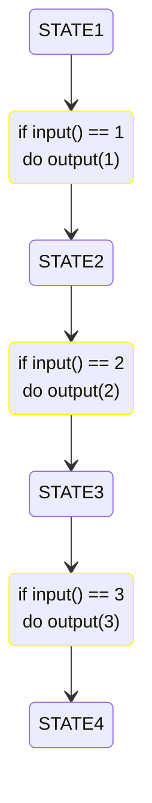
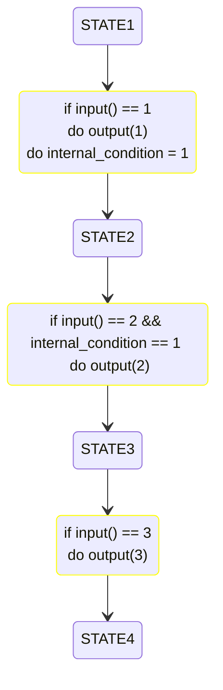

# Good and Bad Test Example
This is an example about how to test in a good way and in a bad way a finite state machine.

The code implements an FSM with the behaviour shown below:


In the [GoodStateMachineTest.cpp](good_bad_test_example/test/GoodStateMachineTest.cpp) file, the tests are done exciting the code using only its interfaces. However, in the [BadStateMachineTest.cpp](good_bad_test_example/test/BadStateMachineTest.cpp) file, the tests are done hacking the internal variables of the code under test.

The [StateMachine.c](good_bad_test_example/src/StateMachine.c) file has some commented lines, if you remove the comments you will get to this behaviour:


If you try to test this second behaviour, the written tests in [BadStateMachineTest.cpp](good_bad_test_example/test/BadStateMachineTest.cpp) file will fail. The reason is that for testing, this file is hacking the internal behaviour of the software unit so this test strategy force you to update the tests.  
If you update the tests of [BadStateMachineTest.cpp](good_bad_test_example/test/BadStateMachineTest.cpp) file setting ```internal_condition = 1``` in the SetOutputTo2 test, the test suite will pass.  
But if you remove the statement ```internal_condition = 1;``` from ```do_state1_to_state2``` transition function, the test suite from [BadStateMachineTest.cpp](good_bad_test_example/test/BadStateMachineTest.cpp) file will continue passing, however the test suite from [GoodStateMachineTest.cpp](good_bad_test_example/test/GoodStateMachineTest.cpp) file will fail. This is another reason for not hacking the behaviour of a software component when you are testing, some bugs can be not detected because you are not running the code in the way it was designed to run.
